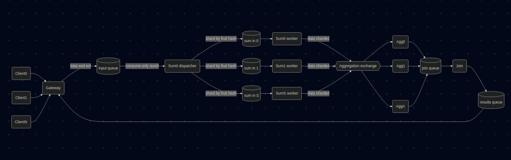
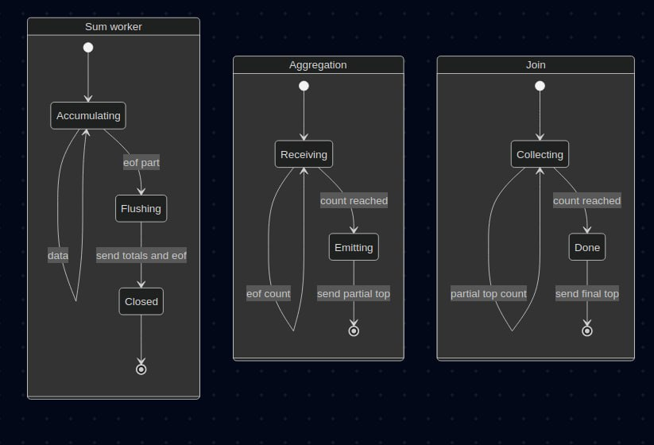

# Informe — TP Coordinación (Sistema Distribuido)

## Introducción
Este trabajo práctico aborda el diseño de un protocolo de coordinación para un sistema distribuido compuesto por los controles **Gateway → Sum → Aggregation → Join → Gateway**. El objetivo principal es mantener **correctitud** y **terminación** al escalar el sistema en:
- cantidad de clientes concurrentes,
- cantidad de réplicas de `Sum`,
- cantidad de réplicas de `Aggregation`,
bajo cambios en docker-compose, datasets y en la implementación de `FruitItem`.

## Objetivos
- Soportar múltiples consultas concurrentes sin mezclar estados.
- Coordinar el fin de ingesta (EOF) sin pérdidas ni condiciones de carrera.
- Evitar duplicación de cómputo al replicar `Aggregation`.
- Cumplir con los escenarios de prueba 1 a 5.
- Implementar **apagado ordenado** ante SIGTERM a nivel de cada instancia (sin propagación).

---

## Desarrollo

### 1. Protocolo interno de mensajes
Se utiliza un protocolo interno (JSON) con mensajes tipados por estructura:

- **Datos:** `["query_id", "fruit", amount]`  
  Suma `amount` a `fruit` dentro de la consulta `query_id`.

- **EOF broadcast (Gateway):** `["query_id", "__EOF_BROADCAST__"]`  
  Indica que no habrá más datos para la consulta `query_id`.

El `query_id` se genera en el Gateway (en `message_handler`) y se propaga por todas las etapas, permitiendo mantener estado aislado por consulta.

---

### 2. Coordinación y escalamiento de Sum

#### 2.1 Problema
Con `SUM_AMOUNT > 1`, la cola de entrada funciona como **work queue**. Si el EOF se maneja directamente sobre esa cola compartida, puede ocurrir:
- que solo una réplica reciba el EOF,
- o que distintas réplicas procesen claves de forma no determinística,
- provocando bloqueos (espera indefinida aguas abajo) o resultados inconsistentes.

#### 2.2 Solución: dispatcher + colas particionadas
Se implementó un esquema de particionado determinístico:
- La instancia `sum_0` (ID=0) actúa como **dispatcher** y consume desde `INPUT_QUEUE`.
- Se crean colas internas: `sum_in_i` para `i ∈ [0, SUM_AMOUNT-1]`.
- Cada registro se asigna a una partición según `pid = crc32(fruit) % SUM_AMOUNT`.
- Cada `sum_i` consume exclusivamente su `sum_in_i`.

**Escalamiento:** al incrementar `SUM_AMOUNT`, se crean más particiones `sum_in_i` y el cómputo se distribuye por clave (fruta), manteniendo afinidad por fruta y evitando trabajo duplicado entre sums.

#### 2.3 EOF confiable por partición (sin carreras)
El EOF broadcast `["query_id","__EOF_BROADCAST__"]` recibido por el dispatcher se traduce a:
- `["__EOF_PART__", "query_id"]` (uno en cada `sum_in_i`).

Cada worker `sum_i` al recibir `__EOF_PART__`:
- flushea sus acumulados para `query_id`,
- envía sus totales hacia `Aggregation`,
- envía un EOF hacia `Aggregation` para el mismo `query_id`.

**Caso borde contemplado:** el EOF efectivo viaja por la misma cola particionada `sum_in_i` que los datos de esa partición (FIFO), por lo que el EOF no puede adelantarse a datos previamente encolados para la misma partición.

#### 2.4 Consideración de viabilidad (volumen y réplicas)
El dispatcher mantiene instancias cacheadas de las colas internas `sum_in_i`, reutilizándolas para envíos sucesivos y evitando crear conexiones/canales por mensaje.

---

### 3. Coordinación y escalamiento de Aggregation

#### 3.1 Problema
Con `AGGREGATION_AMOUNT > 1`, si `Sum` emite por broadcast los mismos totales a todas las instancias de `Aggregation`, el `Join` consolidaría valores inflados (duplicación).

#### 3.2 Solución: sharding determinístico Sum → Aggregation
La emisión desde `Sum` hacia `Aggregation` se particiona por fruta:
- `agg_id = crc32(fruit) % AGGREGATION_AMOUNT`
- cada fruta se envía a **una sola** instancia `aggregation_agg_id`.

**Escalamiento:** al incrementar `AGGREGATION_AMOUNT`, se agregan más particiones de consolidación; cada aggregator procesa un subconjunto de frutas, evitando duplicación.

#### 3.3 EOF en Aggregation (barrera por conteo)
Cada `sum_i` envía EOF `["query_id"]` a todas las instancias de `Aggregation`.
Cada `aggregation_k` finaliza cuando `eof_count[query_id] == SUM_AMOUNT`. En ese punto calcula su top parcial y envía `["query_id", partial_top]` a `Join`.

---

### 4. Join
`Join` acumula `AGGREGATION_AMOUNT` tops parciales por `query_id`, fusiona por fruta y emite el top final hacia `results_queue` para que el Gateway lo entregue al cliente.

---

### 5. Escalamiento con múltiples clientes (concurrencia)
El Gateway asigna un `query_id` distinto por cada conexión de cliente. Todas las etapas (`Sum`, `Aggregation`, `Join`) mantienen estado separado por `query_id`, lo que permite que múltiples consultas estén activas de manera concurrente (mensajes intercalados) sin mezclar resultados.
Finalmente, el Gateway entrega el resultado al cliente correcto filtrando por `query_id` en `deserialize_result_message`.

---

### 6. Manejo de SIGTERM (apagado ordenado)
Se implementó el manejo local de `SIGTERM` en `Sum`, `Aggregation` y `Join`. Ante la señal se detiene el consumo cuando corresponde, se cierran conexiones/canales y se finaliza la instancia, sin propagar la señal al resto del sistema.

---

## Diagramas

---

## Resultados (propiedades)
- **Correctitud:** no hay duplicación al escalar `Aggregation` por sharding determinístico.
- **Terminación (ejecución normal):** `Aggregation` cierra por conteo de `SUM_AMOUNT` EOFs y `Join` cierra por conteo de `AGGREGATION_AMOUNT` parciales.
- **Escalabilidad:** aumenta capacidad al incrementar `SUM_AMOUNT` y/o `AGGREGATION_AMOUNT`, distribuyendo procesamiento por clave.

---

## Conclusión
La solución implementa coordinación distribuida basada en particionado determinístico por fruta, aislamiento por `query_id` y barreras de cierre por conteo. Esto permite escalar clientes y controles manteniendo correctitud del Top-K bajo condiciones ordinarias.